# 아이이뽀(IE4) 시연 시나리오

------

## 목차

1. 회원가입 / 로그인 버튼
2. 내 정보 버튼
3. 시간표 버튼
4.  학사일정 버튼
5. MVP 버튼
6. 공지사항 / 학습자료 버튼
7. 우리반 버튼
8. 방 만들기 / 참여하기 버튼

------

## 1. 회원가입 / 로그인 버튼

> ​	회원가입/로그인 디자인 및 회원가입 중복버튼 / 유효성 검사가 가능하다.

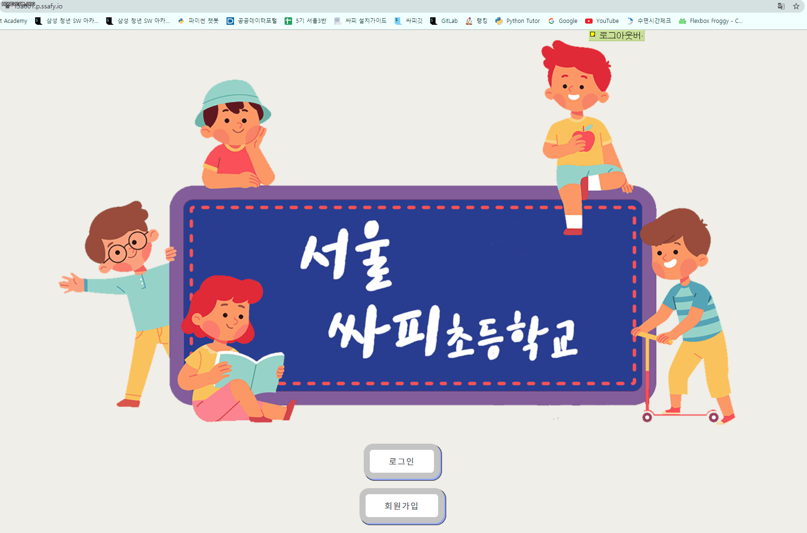

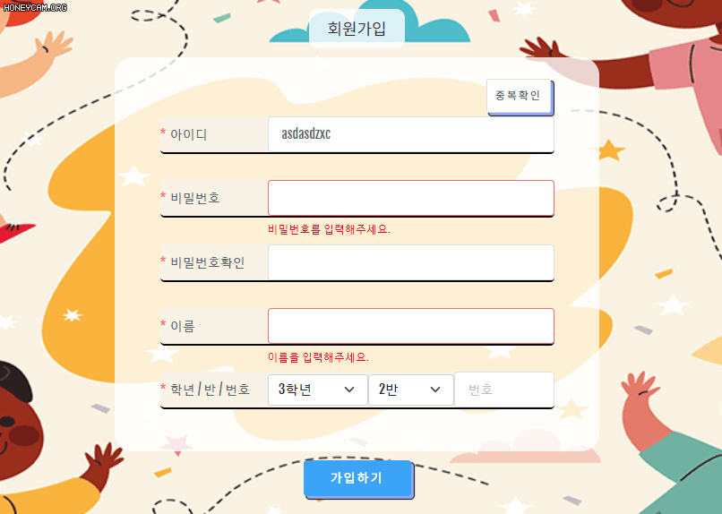

## 2. 내 정보 버튼

> 내 정보 수정시 유효성 검사와 비밀번호,주소,전화번호 변경 및 선생님만 가능한 우리반 급훈 수정 할 수 있다.
>
> 탈퇴 버튼은 비밀번호 확인 후 바로 가능하다.

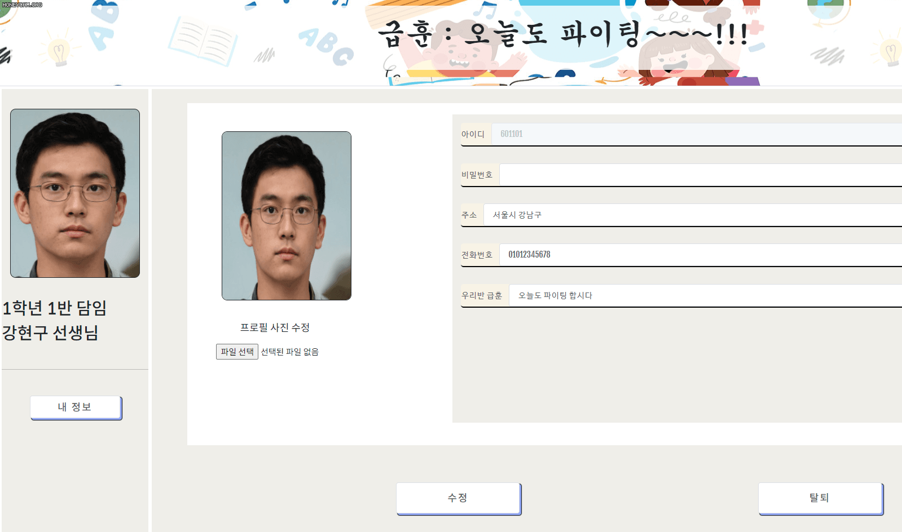

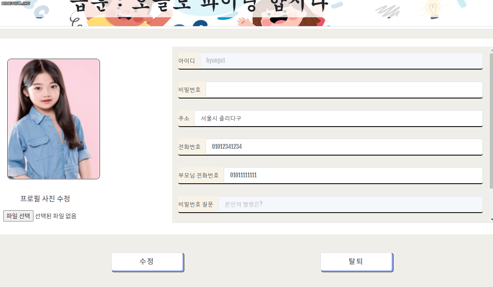

## 3. 시간표 버튼

> ​	선생님은 파일 선택후 미리 만들어 놓은 시간표를 가져와 수정할 수 있다

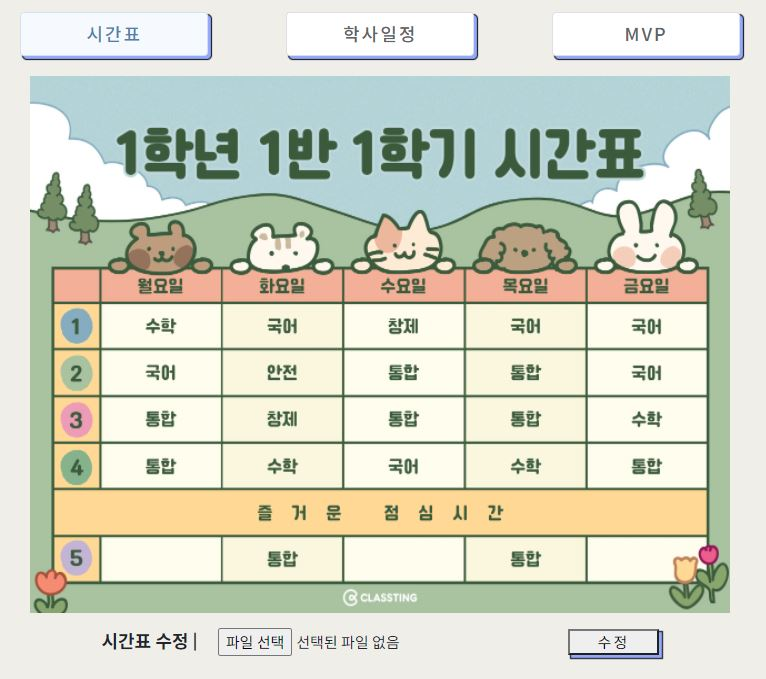

## 4. 학사일정 버튼

> ​	나이스에서 제공하고있는 학사일정 API를 활용했습니다.

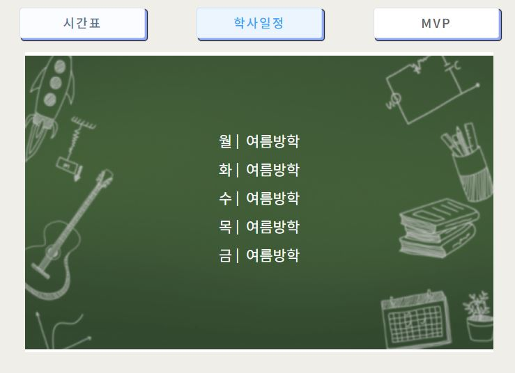

## 5. MVP 버튼

> WebRTC 안에서 선생님이 학생에게 점수주기를 통해 실시간으로 등수가 바뀐다.

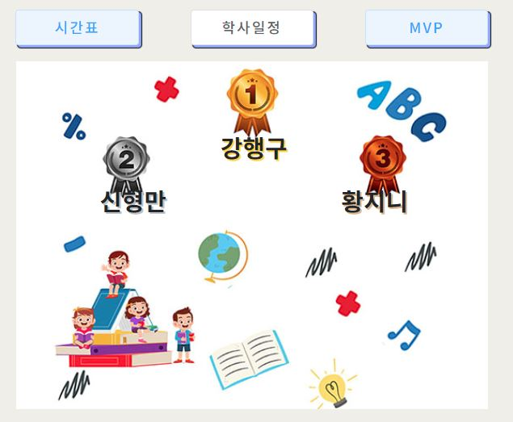

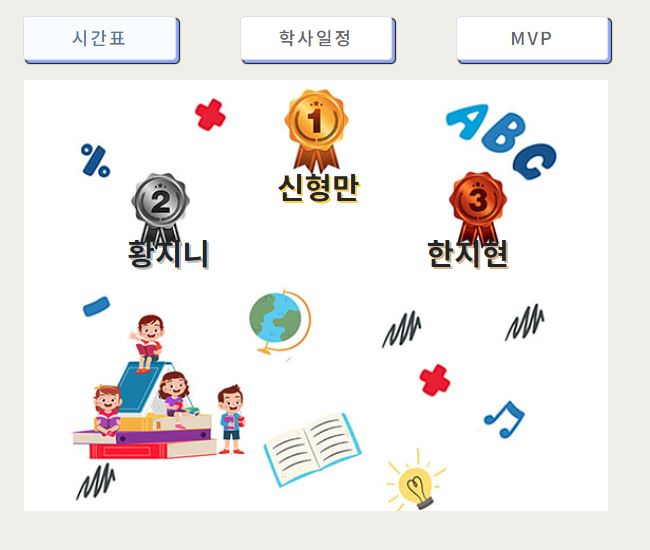

## 6. 공지사항/ 학습자료 버튼

> 선생님은 본인글을 수정및 삭제를 할 수있고, 따른 학생및 선생님들은 내려받기를 통해 이미지파일을 볼 수 있다.

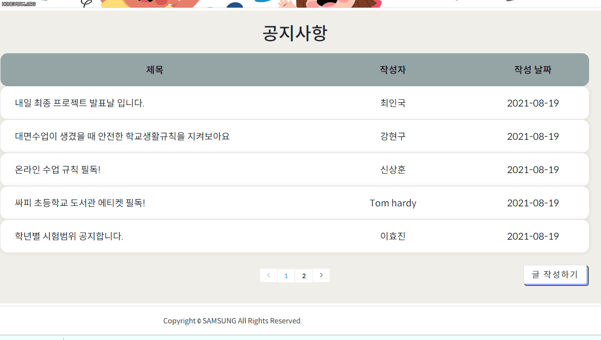

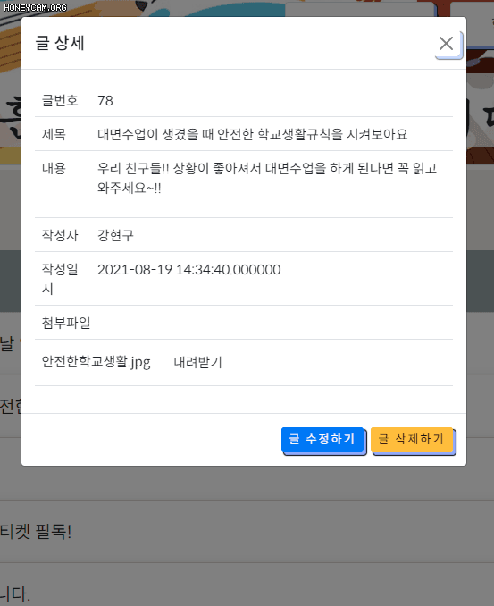

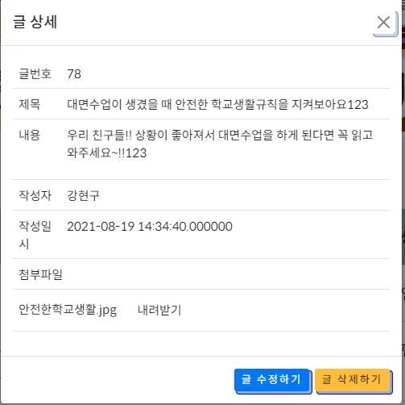

## 7. 우리반 버튼

> 우리반 1학년 1반으로 회원가입한 친구들과 담임선생님의 얼굴이 나열되어있다.

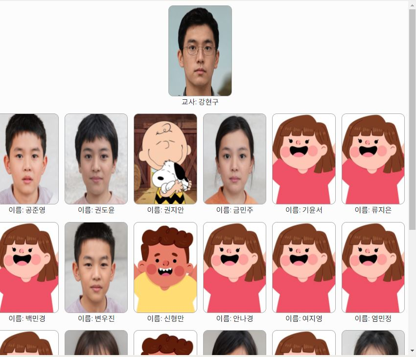

## 8. WebRTC 참여하기/방만들기 버튼

>선생님은 방만들기 버튼을 학생은 참여하기 버튼을 보여주며 선생님이 방을 만들지 않았다면 학생은 경고창을 받게된다. WebRTC 에서는 선생님이 학생에게 점수를 부여하여 MVP 창에 순위를 변동 시킬 수 있다.

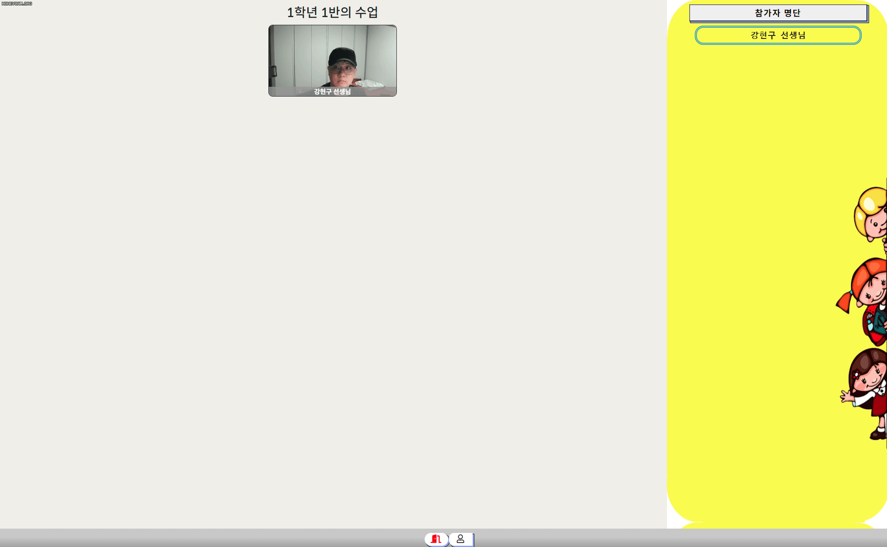

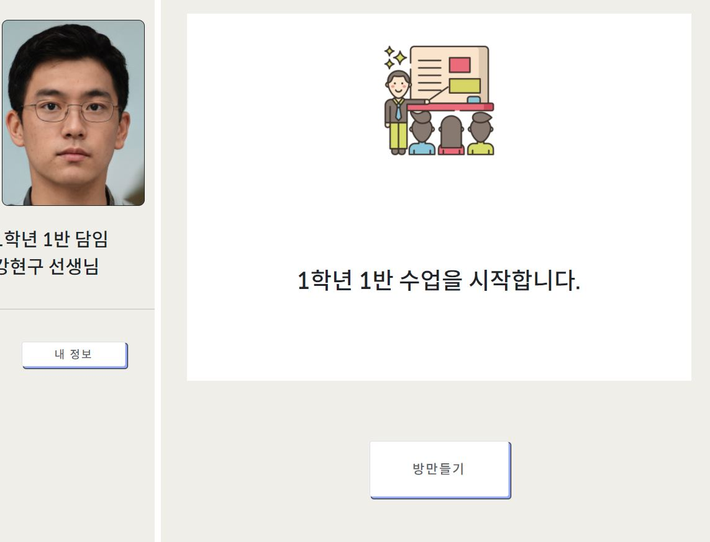

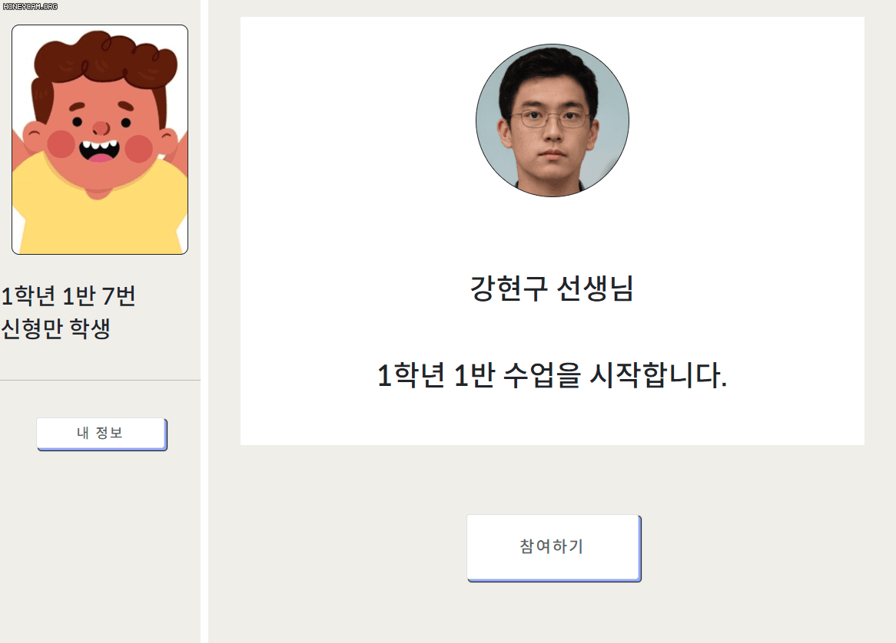